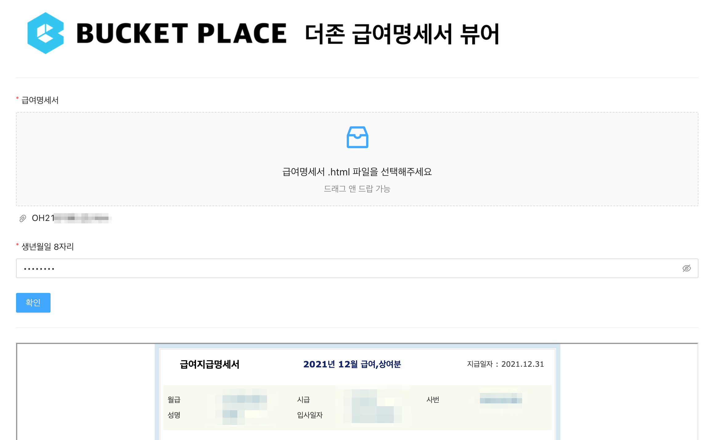
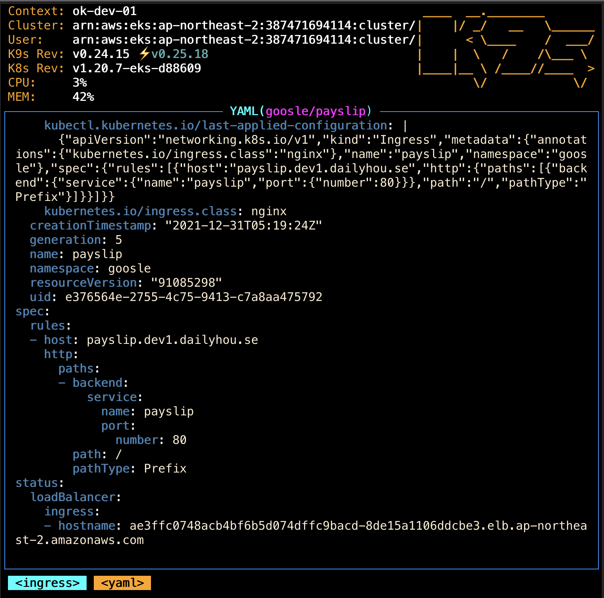
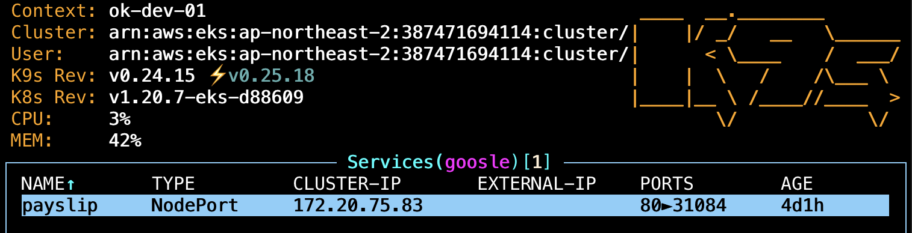
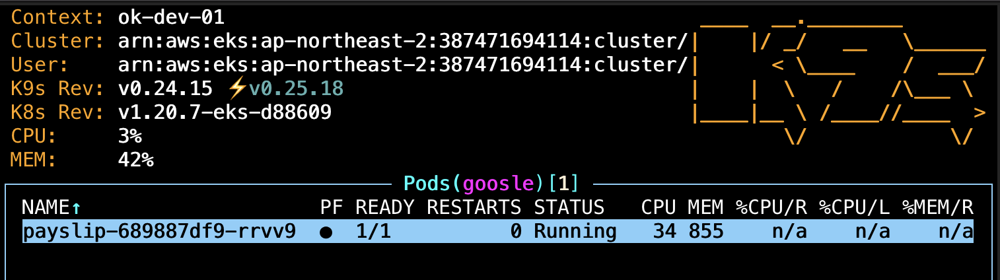
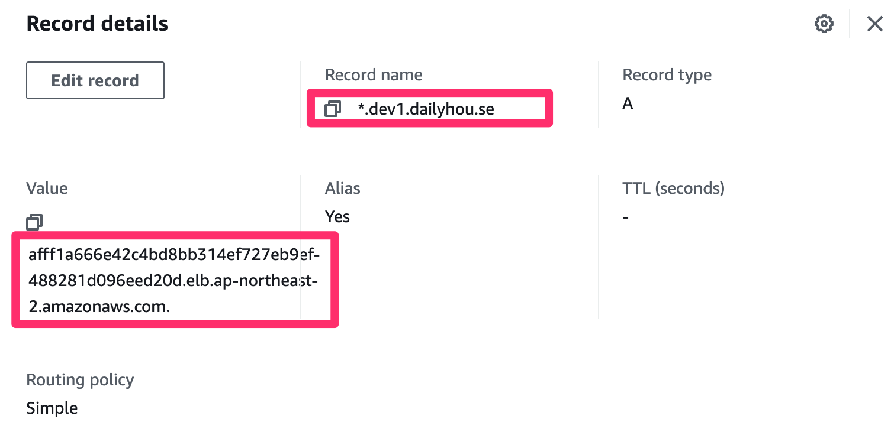

# 더존 급여명세서 뷰어 for Bucketplace

본 프로젝트는 https://github.com/progoosle/douzone-payslip-viewer 를 버킷플레이스에 맞게 업데이트한 것입니다.



## 2021.12.31 실제 배포
- ok-dev-01 EKS cluster / goosle namespace 에 pod 형태로 배포

- k8s 폴더에 ingress, service, deployment 정의
  
  
  

- 처음에는 payslip.dev.dailyhou.se 로 진행하려다가 이건 새로운 aws-dev의 EKS cluster와 관련있는 관계로 dev1.dailyhou.se 로 변경

- ACM 에서 *.dev.dailyhou.se certificate 생성한 뒤, route53 에서 ok-dev-01 cluster lb로 A record 매핑함
  

- 실제로 pod 안에서 screen session 으로 yarn start 가 돌고 있음.  `yarn start`를 그냥 직접 돌리면 pod 가 생성 직후 crash 됨... 왜 그런지는 나중에 여유되면 밝힐 생각...

===

설치 프로그램 없이 모든 브라우저에서 사용할 수 있는 급여명세서 뷰어입니다.

바로 이동 ➡️ https://payslip.dev1.dailyhou.se

## 사용

1. [뷰어 사이트](https://payslip.dev1.dailyhou.se)에 접속하세요.
2. 급여명세서(.html 확장자) 파일을 업로드하세요.
3. 생년월일 8자리를 입력하세요.
4. 확인 버튼을 누르세요.
5. 급여를 확인합니다.💰
 
## 개인정보보호

트래픽 분석을 위한 구글 애널리틱스 기본 페이지 접속 정보 수집 외 **급여명세서, 주민등록번호를 포함한 그 어떠한 정보도 수집하지 않으며, 또한 서버로 전송하지 않습니다.** 모든 복호화 처리는 로컬에서 이루어집니다.

## 직접 설치

`create-react-app` 프로젝트입니다.

```bash
git clone https://github.com/rajephon/douzone-payslip-viewer.git
cd douzone-payslip-viewer
yarn install
yarn start
```

## 레퍼런스

- 급여명세서 복호화하기 : [https://enghqii.tistory.com/42](https://enghqii.tistory.com/42)

## LICENSE

MIT
